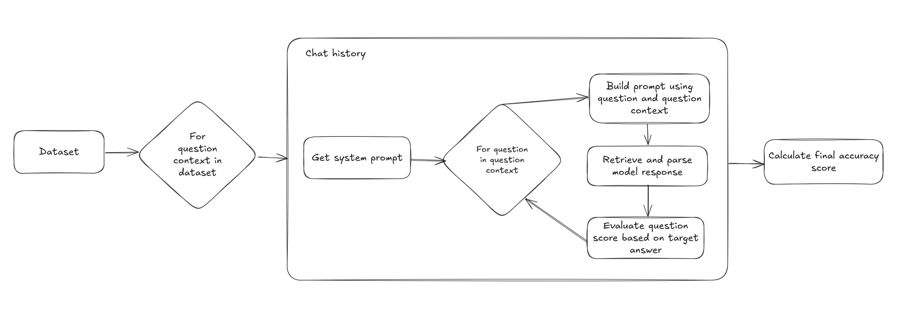

# Evaluation Report

## Introduction

The aim of this project is to evaluate the feasibility of using the newly released DeepSeek R1 distilled models for financial question answering on the `train.json` portion of the [ConvFinQA](https://github.com/czyssrs/ConvFinQA) dataset.

The models selected for evaluation were:
- **DeepSeek R1 14B**: a distilled **Qwen-based** 9GB model hosted locally using the **Ollama backend**.
- **DeepSeek R1 70B**: a distilled **Llama-based** model accessed via the **Groq free-tier API**.

Both models are accessible for free either locally or through third-party APIs, making them attractive alternatives to more expensive frontier LLMs.

---

## Approach

A simplified representation of the approach used in this pipeline is shown in the flowchart below:



Additionally, the pipeline includes logging and caching, making the process fault-tolerant and improving development speed.

### Prompting

The goal of this evaluation is to assess how the latest reasoning models perform on financial question answering. I used a **zero-shot prompting approach** with minimal examples of expected responses, as DeepSeek's technical report suggests that this performs better than few-shot or chain-of-thought prompting. The model handles most of the reasoning process automatically. The prompt also includes instructions to mitigate common edge cases and issues identified during testing. The full prompt used is available in:

`src/deepseek_fin_qa/prompts.py`

In addition to the static system prompt, the model receives a dynamic user prompt containing the question and context (constructed from the `pre_text`, `post_text`, and `table_ori` fields of the dataset).

For **multi-step Q&As**, a feature specific to ConvFinQA, questions are processed sequentially, with both the input and output of each question added to the LLM’s chat history. This ensures that the model has access to previous questions when answering follow-ups within the same context.

---

### Pre-processing

To ensure comparability with the original dataset, no pre-processing was applied that would alter the dataset structure. The only pre-processing step was:

- **Combining context fields into a single string.**
- **Converting tables into Markdown format**, which significantly improved LLM performance.

---

### Post-processing

A common issue that I experienced during development and that is also well documented online, is that the Deepseek models often do not return responses in the requested JSON output. This made it harder for me to parse the responses in order to properly evaluate the results. I have applied the following post-processing steps in order to get as much structured data out of the LLM as possible, but this proved to be a big issue with the distilled model and I have not found a definitive solution yet.

Parsing steps:
1. Ignore model reasoning by skipping past the `</think>`
2. Skip additional output by only parsing content formatted within curly brackets
3. For float values, parse values using regex to avoid issues with extra characters (e.g. `$30million`)

Despite these steps, **structured output remained inconsistent**, and some responses could not be processed. As a result, some instances where the model failed to return a structured response were excluded from evaluation.

---

## Evaluation

### Metrics Selection

Following the original ConvFinQA paper, I measured:

1. **Execution Accuracy (`Exe Acc`)**: Whether the numerical answer (typically a float or `"yes"/"no"`) matches the target value.
2. **Program Accuracy (`Prog Acc`)**: Whether the program used to compute the answer is correct based on the provided data (e.g., `subtract(4, add(6,8))` should yield `-10`).

This metric choice allows for a partial comparison with the results reported in the ConvFinQA paper.

To determine if the LLM answer matches the target, I applied the following evaluation steps:

#### Answer Execution Value
1. Strip any extra characters.
2. Identify the rounding factor used in the target answer.
3. Apply the same rounding to the LLM-generated answer.
4. Convert values to floats and check equivalency using `math.isclose()`.
5. Ignore signs for percentage values (since the sign of a difference is ambiguous).
6. Account for inconsistencies in target answer rounding.

#### Answer Program
1. Normalize whitespace in the program.
2. Convert constant references to actual values.
3. Safely execute the program to compute the expected result.
4. Consider programs equivalent if they produce the same result (within floating-point error).
5. Account for percentage values being on a 0-100 or 0-1 scale.

---

## Results

### Performance Overview

The full evaluation results on `train.json` are:

#### DeepSeek R1 14B
- **Runtime**: ~16 hours on **RTX 4070 Ti (12GB)**
- **Execution Accuracy (`Exe Acc`)**: **67.17%**
- **Program Accuracy (`Prog Acc`)**: **68.58%**

#### DeepSeek R1 70B
- **Runtime**: ~24 hours on **Groq free-tier API**
- **Execution Accuracy (`Exe Acc`)**: **72.22%**
- **Program Accuracy (`Prog Acc`)**: **74.53%**

---

### **Comparison to ConvFinQA Baselines**

| Model                         | Exe Acc  | Prog Acc  |
|--------------------------------|---------|----------|
| **DeepSeek R1 14B (Qwen-base)** | **67.17%** | **68.58%** |
| **DeepSeek R1 70B (Llama-base)** | **72.22%** | **74.53%** |
| GPT-2 (medium)                 | 58.19%  | 57.00%  |
| T-5 (large)                    | 58.66%  | 57.05%  |
| FinQANet (BERT-base)           | 55.03%  | 54.57%  |
| FinQANet (BERT-large)          | 61.14%  | 60.55%  |
| FinQANet (RoBERTa-base)        | 64.95%  | 64.16%  |
| FinQANet (RoBERTa-large)       | 68.90%  | 68.24%  |
| FinQANet-Gold (RoBERTa-large)  | 77.32%  | 76.46%  |
| Human Expert Performance       | 89.44%  | 86.34%  |
| General Crowd Performance      | 46.90%  | 45.52%  |

DeepSeek R1 14B performs comparably to **FinQANet (RoBERTa-large)**, while **DeepSeek R1 70B surpasses all models except FinQANet-Gold** (which benefits from additional supporting facts). However, both models still lag behind human performance.

---

## Conclusion

The modern, distilled reasoning models **DeepSeek R1 14B and 70B** outperform historical state-of-the-art models **out-of-the-box with minimal setup**. This is particularly impressive given that the evaluation was conducted in a short time frame using consumer hardware or free APIs.


### Key Observations
1. **Frequent invalid output formatting**
   - The models often fail to return valid JSON, making parsing difficult.
   - Improved prompt engineering and post-processing may mitigate this issue.

2. **Potential for improvement through parsing refinements**
   - Additional work on structured output extraction may improve overall accuracy.
   - Better alignment between reasoning steps and answer generation could improve program accuracy.


## Final Thoughts

DeepSeek R1 14B and 70B provide strong results, with the **70B variant outperforming most prior models**. However, structured reasoning and output formatting remain challenges, and further refinements in prompt engineering and parsing may improve accuracy.

---

## Evaluation Examples

### Example 1: Correct answer
```
Question: what was the percentage change of unrecognized tax benefits at year end between 2017 and 2018?

Target answer:  value='33%'      program='divide(subtract(463, 348), 348)'
LLM answer:     value='32.97%'   program='divide(subtract(463,348),348)'
```

### Example 2: Incorrect answer
```
Question: what portion of the total shares subject to outstanding awards is under the 2009 global incentive plan?
Target answer:  value='70.1%'   program='divide(5923147, add(2530454, 5923147))'
LLM answer:     value='29.93%'  program='multiply(divide(2530454, add(2530454,5923147)), 100)'
```

### Example 3: Correct answer, incorrect target value
```
Question: what was the difference in percentage return for lilly compared to the s&p 500 for the five years ended dec-18?

Target answer:  value=''            program='subtract(divide(subtract(259.88, const_100), const_100), divide(subtract(150.33, const_100), const_100))'
LLM answer:     value='109.55%'     program='subtract(divide(subtract(259.88,100),100),divide(subtract(150.33,100),100))'
```